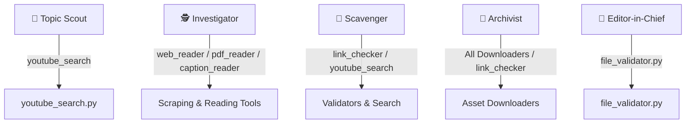

# Technical Analysis: Tool Capabilities, Open-Source Upgrades, and Agent Enhancements

This report provides a thorough analysis of the VideoNut tools, how they are utilized by the agent pipeline, essential development and execution rules (Do's and Don'ts), and advanced open-source library alternatives to upgrade the capabilities of the pipeline.

---

## 1. Current Toolset Analysis & Purpose

Below is an audit of the Python scripts located in the `_video_nut/tools/` directory, summarizing their libraries and main duties.

| Tool Path | Purpose | Primary Libraries | Key Features |
| :--- | :--- | :--- | :--- |
| **`check_env.py`** | Environment Check | `os`, `sys`, `shutil`, `subprocess` | Confirms Python version, FFmpeg binaries, and required packages are ready. |
| **`downloaders/article_screenshotter.py`** | Quote Capture | `playwright.sync_api`, `re` | Navigates to web articles, locates exact quotes using 3 search strategies, highlights text in yellow/orange, centers viewport, and screenshots. |
| **`downloaders/caption_reader.py`** | YouTube Transcripts | `youtube_transcript_api`, `re` | Fetches transcripts/captions from YouTube URLs. Includes fuzzy quote search to map narration sentences to video timestamps. |
| **`downloaders/clip_grabber.py`** | Video Segmenter | `subprocess` (executes `yt-dlp`) | Downloads precise segments of YouTube videos based on start/end timestamps, bypassing full-video downloads. |
| **`downloaders/image_grabber.py`** | Image Downloader | `requests`, `mimetypes` | Downloads static images, checks for MIME safety, and validates file sizes. |
| **`downloaders/pdf_reader.py`** | PDF Text Reader | `pypdf`, `requests` | Downloads PDF papers/dossiers and extracts raw text or searches for keywords. |
| **`downloaders/pdf_screenshotter.py`** | PDF Page Capture | `fitz` (PyMuPDF), `requests` | Downloads a PDF, searches for a term, and saves the specific page containing the match as a high-quality PNG. |
| **`downloaders/screenshotter.py`** | Web Screenshots | `playwright.sync_api` | Captures full-page or element-level screenshots of web interfaces. |
| **`downloaders/web_reader.py`** | Page Scraper | `playwright.sync_api` | Fetches a webpage and returns its raw text for research parsing. |
| **`downloaders/youtube_search.py`** | YouTube Engine | `subprocess` (calling `yt-dlp`) | Searches YouTube for documentary topics and returns video titles, URLs, and metadata. |
| **`validators/archive_url.py`** | WayBack Validator | `requests` | Queries the Wayback Machine API to check if a source URL is archived, and submits it for archiving if missing. |
| **`validators/link_checker.py`** | Link Validator | `requests` | Performs a lightweight HTTP HEAD/GET check with random user-agents to verify if a link is alive. |
| **`logging/search_logger.py`** | History Logger | `json`, `datetime` | Maintains a history of queries, search outcomes, and statistics. |

---

## 2. Agent-to-Tool Mapping Matrix

To understand the pipeline, we must analyze which agents trigger which tools during the documentary production lifecycle.



### Agent Roles & Tool Interactivity
1. **Topic Scout (📡)**: Analyzes competition. Uses `youtube_search.py` to identify popular videos, views, and gaps.
2. **Prompt Agent (🎯)**: Synthesizes the Scout's brief into structured research questions. Runs no tools directly.
3. **Investigator (🕵️)**: Builds the *Truth Dossier*. Uses `web_reader.py` to read articles, `pdf_reader.py` for reports, and `caption_reader.py` to gather facts and verify claims.
4. **Scriptwriter (✍️)**: Writes narration scripts. Consumes the *Truth Dossier* (No direct tools).
5. **Director (🎬)**: Identifies visual assets. Inserts bracketed markers in the script (e.g., `[Screenshot-Quote: "..."]` or `[VideoClip: "..."]`).
6. **Visionary (🎨)**: Creates visual generation prompts (Midjourney/Stable Diffusion) for scenes lacking real-world footage.
7. **Scavenger (🦅)**: Finds source links. Uses `link_checker.py` to verify URLs and `youtube_search.py` to locate corresponding footage.
8. **Archivist (💾)**: Secures assets to local storage. Uses **all downloaders** (`image_grabber.py`, `article_screenshotter.py`, `clip_grabber.py`, `pdf_screenshotter.py`, etc.) and renames files systematically.
9. **Editor-in-Chief (🧐)**: Quality control. Uses `file_validator.py` to check for 0-byte or corrupted assets and verifies logs.
10. **Thumbnail Agent (🎨)**: Generates thumbnail concept prompts.
11. **SEO Agent (🔍)**: Performs metadata optimization.

---

## 3. DO'S and DON'TS for Tool and Agent Development

### DO'S
* **Do: Pre-Validate Links**: Always run `link_checker.py` before downloading to prevent script crashes from dead links.
* **Do: Use Transcript-First Workflows**: Always run `caption_reader.py` before running `clip_grabber.py` to isolate the exact target timestamp range.
* **Do: Handle Failures Gracefully**: If a download fails, write to `MANUAL_REQUIRED.txt` and continue the process instead of aborting the pipeline.
* **Do: Enforce System Naming Conventions**: Rename files to `Scene_{SceneNum}_{AssetID}_{ShortDesc}.{ext}` so the video editor can map assets instantly.
* **Do: Center Viewports in Playwright**: When screenshotting article quotes, scroll the target text into the vertical center of the screen, not just the top, so it reads naturally.

### DON'TS
* **Don't: Execute Agents as Python Scripts**: Agents are Markdown instructions (.md), not executables. Do not invoke `python eic.py`.
* **Don't: Download Full Videos**: Never download full-length YouTube videos (e.g., a 2-hour broadcast) if only a 15-second quote is needed. Use range-based clipping.
* **Don't: Scrape Dynamic Sites with requests**: Do not use `requests` for JavaScript-heavy websites (e.g., Twitter, interactive dashboards). Use browser-based Playwright scraping.
* **Don't: Hardcode Absolute Paths**: Always compute paths relative to the project directory or the `config.yaml` definitions.
* **Don't: Leave 0-Byte Files**: Never create placeholder or empty files when downloads fail, as this breaks post-validation checks.

---

## 4. Advanced Open-Source Upgrades & Alternatives

Here is an analysis of library replacements that can replace current tools, along with advantages, disadvantages, and scenarios.

### A. Web Scraping & Text Cleanliness (Replacement for `web_reader.py`)
* **Current Library**: Playwright (`playwright.sync_api`) extracting raw text.
* **Proposed Upgrades**:
  * **Trafilatura** (for static news/blog articles)
  * **Crawl4AI** (for dynamic pages destined for LLM parsing)

#### Trafilatura Comparison
* **Advantages**:
  * **Exceptional Boilerplate Removal**: Automatically strips ads, cookie banners, navigation menus, and footers, leaving only the primary article content.
  * **Speed & Efficiency**: Runs pure Python text/HTML parsing without spawning a heavy browser instance. Up to 20x faster than Playwright.
  * **Metadata Extraction**: Natively extracts author names, publication dates, and tags.
* **Disadvantages**:
  * Cannot execute JavaScript. If a page requires client-side rendering (e.g., SPAs like React/Vue), it fails to fetch content.
* **Scenario**: Ideal for the **Investigator** when scraping static newspaper archives or government reports.

#### Crawl4AI Comparison
* **Advantages**:
  * **LLM-Ready Output**: Specifically designed to convert dynamic pages into clean, structured Markdown or JSON.
  * **JS Execution**: Uses Playwright internally, rendering complex client-side applications.
* **Disadvantages**:
  * Higher memory overhead and requires Playwright browser binaries.
* **Scenario**: Best for **Investigator** when scraping modern web applications or sites with infinite scroll.

---

### B. Segment-Based Video Downloads (Upgrade for `clip_grabber.py`)
* **Current Method**: Executing `yt-dlp` command-line binaries via shell `subprocess`.
* **Proposed Upgrade**: Native **`yt-dlp` Python Library API** using `download_ranges`.

```python
import yt_dlp
from yt_dlp.utils import download_range_func

ydl_opts = {
    'format': 'bestvideo+bestaudio/best',
    'download_ranges': download_range_func(None, [(start_seconds, end_seconds)]),
    'force_keyframes_at_cuts': True,
    'outtmpl': output_filepath
}
```

* **Advantages**:
  * **No Subprocess overhead**: Eliminates command-line string escaping issues on Windows.
  * **Direct Error Handling**: Catches Python exceptions (`DownloadError`) rather than parsing stdout/stderr strings.
  * **Frame-Accurate Cuts**: Setting `force_keyframes_at_cuts` makes FFmpeg split exactly at the requested time, preventing black-frame cutoffs.
* **Disadvantages**:
  * Requires correct local path configuration for FFmpeg within the Python runtime.
* **Scenario**: Ideal for the **Archivist** when slicing precise quote segments.

---

### C. PDF Data Extraction (Upgrade for `pdf_reader.py`)
* **Current Library**: `pypdf`.
* **Proposed Upgrade**: **`pdfplumber`** (with `pypdfium2` for speed).

#### pdfplumber Comparison
* **Advantages**:
  * **Layout-Aware Extraction**: Maintains columns and paragraph blocks, preventing text from separate columns from merging.
  * **Robust Table Extraction**: Natively extracts tables into structured lists/DataFrames.
  * **Coordinates & Fonts**: Returns word coordinates, allowing agents to know exactly where on a page a citation is located.
* **Disadvantages**:
  * Significantly slower and uses more memory than `pypdf`.
* **Scenario**: Essential for **Investigator** when extracting financial sheets, tables, or multi-column reports.

---

### D. Audio Transcription Fallback (Upgrade for `caption_reader.py`)
* **Current Method**: `youtube-transcript-api` (fails if the video has disabled captions or is in an unsupported language).
* **Proposed Upgrade**: **Local Whisper transcription (`faster-whisper`)**.

* **Advantages**:
  * **Independence**: Generates transcripts even if the YouTube video has no uploaded captions.
  * **High Accuracy**: Whisper is highly robust to accents and background noise.
  * **Word-Level Timestamps**: Provides precise timestamp ranges for words and sentences, enabling highly accurate clipping.
* **Disadvantages**:
  * High compute requirements (requires GPU or takes longer on CPU). Adds ~100MB+ in model weight downloads.
* **Scenario**: Essential backup for the **Archivist** or **Scavenger** when verifying videos lacking transcripts.

---

## 5. Recommended Agent Enhancements (No Bloat)

To keep the pipeline focused on core research, scripting, and asset management without introducing heavy video-generation bloat, we recommend adding these functional capabilities to the agents:

### 1. Investigator: Active Fact-Check Verification Loop
* **The Gap**: Currently, the Investigator relies on provided or easily reachable URLs. It doesn't actively cross-verify statements against conflicting reports.
* **Addition**: Add a **Search-Verify Loop** in the investigator prompt. If a claim is loaded from a source, the agent must construct a search query (e.g., `"{claim}" debunked OR controversy`) using `youtube_search.py` or web searches to check for conflicting viewpoints, ensuring unbiased documentary scripts.

### 2. Director: Shot-Matching Asset Manifest Verification
* **The Gap**: The Director requests scenes (e.g., "Show footage of silicon valley in 1980"), but the Scavenger sometimes grabs whatever is available. There is no confirmation that the downloaded asset actually matches the prompt description.
* **Addition**: Add a **Metadata Validation Step** for the Scavenger. Compare the downloaded YouTube video tags/descriptions against the Director's shot descriptions using cosine similarity or LLM checks before adding them to the final manifest.

### 3. Scavenger: Semantic Quote Locator
* **The Gap**: Currently, finding the exact start and end times for a quote is left to manual matching or a simple substring search in the transcript.
* **Addition**: Equipping the Scavenger with a **Semantic search helper**. The agent submits the target quote, and a script searches the transcript using embeddings or fuzzy semantic matching to extract the exact `[Start, End]` timestamps automatically, saving hours of manual timeline hunting.
