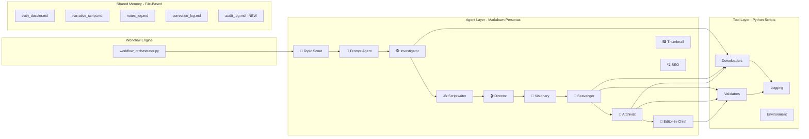

# 🎯 VideoNut Upgrade — True Source of Truth
> **Status**: IN PROGRESS | **Version**: 1.0 | **Last Updated**: 2025-06-17
>
> This document is the single-stop reference for the entire VideoNut tool upgrade.
> It consolidates analysis, theory, edge cases, implementation phases, open-source alternatives,
> agent-tool mapping, DO's & DON'Ts, and verification checklists.
> Follow this document until fully upgraded.

---

## Table of Contents
1. [System Architecture Overview](#1-system-architecture-overview)
2. [Complete Toolset Inventory](#2-complete-toolset-inventory)
3. [Agent-to-Tool Mapping Matrix](#3-agent-to-tool-mapping-matrix)
4. [Edge Cases & Hidden Gaps Identified](#4-edge-cases--hidden-gaps-identified)
5. [Open-Source Library Analysis & Alternatives](#5-open-source-library-analysis--alternatives)
6. [Recommended Agent Enhancements](#6-recommended-agent-enhancements)
7. [DO's and DON'Ts](#7-dos-and-donts)
8. [Implementation Phases](#8-implementation-phases)
9. [New Tools to Create](#9-new-tools-to-create)
10. [Existing Tools to Modify](#10-existing-tools-to-modify)
11. [Verification Checklist](#11-verification-checklist)
12. [Progress Tracker](#12-progress-tracker)

---

## 1. System Architecture Overview



### Key Architecture Constraints
- **File-Based IPC**: Agents communicate via shared markdown files. The audit logger must append-only to avoid corrupting agent-generated artifacts.
- **Agents are NOT executables**: Agent personas are `.md` files containing instructions. They are interpreted by the AI CLI tool (Claude Code, Gemini CLI, etc.), not by `python agent.py`.
- **`subprocess.run(shell=True)` is fragile on Windows**: The upgrade to native Python APIs reduces shell reliance.

---

## 2. Complete Toolset Inventory

### 2.1 Downloaders (`_video_nut/tools/downloaders/`)

| # | Tool | Size | Libraries | Purpose | Status |
|---|------|------|-----------|---------|--------|
| 1 | `article_screenshotter.py` | 20.6KB | `playwright` | Finds exact quotes on web pages, highlights them, centers viewport, screenshots | ✅ Keep |
| 2 | `caption_reader.py` | 10.4KB | `youtube_transcript_api` | Fetches YouTube transcripts, fuzzy quote-to-timestamp matching | 🔄 Upgrade |
| 3 | `clip_grabber.py` | 3.9KB | `subprocess` → `yt-dlp` CLI | Downloads precise video segments by start/end timestamps | 🔄 Upgrade |
| 4 | `image_grabber.py` | 3.9KB | `requests`, `mimetypes` | Downloads images with MIME validation and size checks | ✅ Keep |
| 5 | `pdf_reader.py` | 7.4KB | `pypdf` | Downloads PDFs and extracts text or searches keywords | 🔄 Upgrade |
| 6 | `pdf_screenshotter.py` | 8.2KB | `fitz` (PyMuPDF) | Renders specific PDF pages as PNG screenshots | ✅ Keep |
| 7 | `screenshotter.py` | 2.6KB | `playwright` | General-purpose web page screenshots | 🔄 Upgrade |
| 8 | `web_reader.py` | 3.0KB | `playwright` | Scrapes web pages and returns raw text | 🔄 Upgrade |
| 9 | `youtube_search.py` | 11.5KB | `subprocess` → `yt-dlp` CLI | Searches YouTube for videos by keyword | ✅ Keep |

### 2.2 Validators (`_video_nut/tools/validators/`)

| # | Tool | Size | Libraries | Purpose | Status |
|---|------|------|-----------|---------|--------|
| 1 | `archive_url.py` | 9.3KB | `requests` | Queries Wayback Machine, submits URLs for archiving | ✅ Keep |
| 2 | `link_checker.py` | 2.0KB | `requests` | HEAD/GET check with random user-agents to verify URLs | ✅ Keep |

### 2.3 Logging (`_video_nut/tools/logging/`)

| # | Tool | Size | Libraries | Purpose | Status |
|---|------|------|-----------|---------|--------|
| 1 | `search_logger.py` | 11.4KB | `json`, `datetime` | Maintains search query history & statistics | ✅ Keep |

### 2.4 Environment (`_video_nut/tools/`)

| # | Tool | Size | Libraries | Purpose | Status |
|---|------|------|-----------|---------|--------|
| 1 | `check_env.py` | 2.6KB | `os`, `sys`, `shutil`, `subprocess` | Validates Python, FFmpeg, and dependencies | ✅ Keep |

### 2.5 Root Level

| # | Tool | Size | Libraries | Purpose | Status |
|---|------|------|-----------|---------|--------|
| 1 | `file_validator.py` | 7.5KB | `os`, `json` | EIC uses to verify 0-byte files and asset integrity | ✅ Keep |

### 2.6 Tools to CREATE (New)

| # | Tool | Target Path | Libraries | Purpose |
|---|------|-------------|-----------|---------|
| 1 | `audit_logger.py` | `tools/logging/audit_logger.py` | `json`, `datetime` | Structured audit trail for all pipeline actions |
| 2 | `doc_reader.py` | `tools/downloaders/doc_reader.py` | `python-docx` | Word document (.docx) text extraction & keyword search |
| 3 | `social_media_reader.py` | `tools/downloaders/social_media_reader.py` | `ntscraper`/`snscrape` | Twitter/X post text extraction without login walls |

---

## 3. Agent-to-Tool Mapping Matrix

| Agent | Role | Tools Used | Missing Capability |
|-------|------|-----------|-------------------|
| **📡 Topic Scout** | Competition analysis | `youtube_search.py` | No trending topic API integration |
| **🎯 Prompt Agent** | Research question synthesis | *None (text-only)* | — |
| **🕵️ Investigator** | Truth dossier building | `web_reader.py`, `pdf_reader.py`, `caption_reader.py` | No .docx support, no social media text extraction, no fact-check cross-verification |
| **✍️ Scriptwriter** | Narrative script writing | *None (reads truth_dossier)* | — |
| **🎬 Director** | Visual shot planning | *None (inserts markers)* | No asset-to-shot metadata validation |
| **🎨 Visionary** | AI image prompt writing | *None (text-only)* | — |
| **🦅 Scavenger** | Source link finding | `link_checker.py`, `youtube_search.py` | No semantic quote-to-timestamp matching |
| **💾 Archivist** | Asset downloading & naming | ALL downloaders, `link_checker.py` | No audit logging, no .docx downloads |
| **🧐 Editor-in-Chief** | Quality control | `file_validator.py` | No automated audit log verification |
| **🖼️ Thumbnail** | Thumbnail concepts | *None (text-only)* | — |
| **🔍 SEO** | Metadata optimization | *None (text-only)* | — |

---

## 4. Edge Cases & Hidden Gaps Identified

### 4.1 Critical Edge Cases

| # | Edge Case | Current Behavior | Risk | Solution |
|---|-----------|-------------------|------|----------|
| 1 | **Twitter/X login walls** | `screenshotter.py` renders the login popup instead of tweet content | 🔴 High — tweets are unusable | Nitter mirror redirect before rendering |
| 2 | **YouTube videos with disabled captions** | `caption_reader.py` crashes or returns empty | 🔴 High — no transcript for investigation | `faster-whisper` local transcription fallback |
| 3 | **Multi-column PDF layouts** | `pypdf` merges columns, garbling financial tables | 🟡 Medium — data corruption in reports | Upgrade to `pdfplumber` with layout-aware extraction |
| 4 | **JavaScript-heavy SPA websites** | `trafilatura` alone cannot render JS content | 🟡 Medium — misses dynamic content | Dual-engine: `trafilatura` → `Playwright` fallback |
| 5 | **0-byte failed downloads** | Some tools create empty files on failure | 🔴 High — breaks `file_validator.py` checks | Enforce temp-file-then-rename pattern across all downloaders |
| 6 | **No audit trail** | No record of visited URLs, searches, or downloads | 🔴 High — impossible to verify sources for human review | Create `audit_logger.py` with structured JSON + markdown output |
| 7 | **Word documents (.docx)** | Not supported at all | 🟡 Medium — government & corporate reports ignored | Create `doc_reader.py` |
| 8 | **Social media post text extraction** | Only screenshots, no text content | 🟡 Medium — agents can't read tweet text for analysis | Create `social_media_reader.py` |
| 9 | **Dead link downloading** | `clip_grabber.py` may attempt downloading from dead/private videos | 🟡 Medium — wasted time + empty files | Pre-validate with `link_checker.py` before every download |
| 10 | **Rate limiting on news sites** | `web_reader.py` can get IP-blocked on aggressive scraping | 🟡 Medium — silent failures | Add exponential backoff + rotating user-agents in `web_reader.py` |

### 4.2 Hidden Gaps in Agent Prompts

| # | Gap | Agent(s) Affected | Impact |
|---|-----|-------------------|--------|
| 1 | No instruction to cross-verify claims against opposing sources | Investigator | Biased truth dossier |
| 2 | No instruction to validate that downloaded asset matches the shot description | Scavenger, Director | Wrong footage in final video |
| 3 | No semantic quote-to-timestamp matching (only substring) | Scavenger, Archivist | Inaccurate clip boundaries |
| 4 | No instruction to log actions for human audit | ALL agents | No verification trail |
| 5 | No instruction to handle `.docx` or social media text sources | Investigator | Missing research data |
| 6 | No instruction for news screenshot headline identification | Archivist | Captures full pages instead of key headlines |

---

## 5. Open-Source Library Analysis & Alternatives

### 5.1 Web Scraping — Replace `playwright` raw text in `web_reader.py`

| Library | Type | Speed | JS Support | Boilerplate Removal | Best For |
|---------|------|-------|------------|---------------------|----------|
| **Trafilatura** ⭐ | Static parser | ⚡ 20x faster | ❌ No | ✅ Excellent | News articles, blogs, reports |
| **Crawl4AI** | Dynamic + LLM | 🐌 Moderate | ✅ Yes | ✅ LLM-optimized | SPAs, infinite scroll pages |
| **Playwright** (current) | Browser automation | 🐌 Slow | ✅ Yes | ❌ None | Screenshots, interaction |
| **BeautifulSoup4** | HTML parser | ⚡ Fast | ❌ No | ❌ Manual | Simple HTML extraction |

> **Decision**: Use `trafilatura` as primary engine. Fall back to `Playwright` for JS-heavy sites.

### 5.2 PDF Parsing — Replace `pypdf` in `pdf_reader.py`

| Library | Layout Awareness | Table Extraction | Speed | Memory |
|---------|-----------------|------------------|-------|--------|
| **pdfplumber** ⭐ | ✅ Column-aware | ✅ Native tables | 🐌 Moderate | Higher |
| **pypdf** (current) | ❌ Merges columns | ❌ None | ⚡ Fast | Low |
| **PyMuPDF (fitz)** | ✅ Good | ⚠️ Basic | ⚡ Fast | Moderate |
| **Camelot** | ✅ Excellent tables | ✅ Best for tables | 🐌 Slow | High |

> **Decision**: Use `pdfplumber` as primary. Fall back to `pypdf` if not installed. Keep `fitz` for `pdf_screenshotter.py`.

### 5.3 Video Downloading — Replace `subprocess` CLI in `clip_grabber.py`

| Method | Error Handling | Frame Accuracy | Shell Safety |
|--------|---------------|----------------|-------------|
| **yt-dlp Python API** ⭐ | ✅ Python exceptions | ✅ `force_keyframes_at_cuts` | ✅ No shell |
| **subprocess → yt-dlp CLI** (current) | ❌ Parse stdout/stderr | ⚠️ Depends on args | ❌ Windows escaping issues |

> **Decision**: Rewrite `clip_grabber.py` to use native `yt_dlp.YoutubeDL` API.

### 5.4 Audio Transcription — Fallback for `caption_reader.py`

| Library | Speed | Accuracy | GPU Required | Timestamps |
|---------|-------|----------|-------------|-----------|
| **faster-whisper** ⭐ | ⚡ 4x faster than OpenAI Whisper | ✅ Excellent | ⚠️ Optional (CPU works) | ✅ Word-level |
| **whisper** (OpenAI) | 🐌 Slow | ✅ Excellent | ✅ Recommended | ✅ Segment-level |
| **youtube_transcript_api** (current) | ⚡ Instant | ✅ When available | ❌ No | ✅ Segment-level |

> **Decision**: Keep `youtube_transcript_api` as primary. Add `faster-whisper` fallback when captions are unavailable.

### 5.5 Word Documents — New `doc_reader.py`

| Library | Read | Tables | Images | Headers/Footers |
|---------|------|--------|--------|-----------------|
| **python-docx** ⭐ | ✅ Full | ✅ Yes | ⚠️ Refs only | ✅ Yes |
| **docx2txt** | ✅ Basic | ❌ No | ✅ Extracts | ❌ No |

> **Decision**: Use `python-docx` for full document parsing.

### 5.6 Twitter/Social Media — Text Extraction

| Library | Login Required | Rate Limits | Data Quality |
|---------|---------------|-------------|-------------|
| **Nitter mirrors** ⭐ | ❌ No | ⚠️ Mirror availability | ✅ Clean HTML |
| **ntscraper** | ❌ No | ⚠️ Moderate | ✅ Structured JSON |
| **snscrape** | ❌ No | ⚠️ May break | ✅ Rich metadata |
| **Official API** | ✅ Yes (paid) | ✅ Official | ✅ Best |

> **Decision**: Use Nitter redirect for screenshots + `ntscraper` for text extraction. No paid API dependency.

---

## 6. Recommended Agent Enhancements

### 6.1 Investigator: Fact-Check Cross-Verification Loop
- **Gap**: Currently relies on provided URLs without checking conflicting reports.
- **Enhancement**: Add instruction to construct counter-queries (e.g., `"{claim}" debunked OR controversy`) using web search to ensure balanced reporting.
- **Implementation**: Update `investigator.md` prompt with a "Cross-Verification Protocol" section.

### 6.2 Director: Shot-Matching Validation
- **Gap**: Director requests scenes but no verification that downloaded assets match descriptions.
- **Enhancement**: Add metadata comparison step between Director's shot descriptions and Scavenger's downloaded video tags/descriptions.
- **Implementation**: Update `director.md` and `scavenger.md` prompts.

### 6.3 Scavenger: Semantic Quote-to-Timestamp Matching
- **Gap**: Only substring matching for finding quotes in transcripts.
- **Enhancement**: Use fuzzy matching (e.g., `rapidfuzz` library) to find approximate quote matches in transcripts and extract precise `[start, end]` timestamps.
- **Implementation**: Enhance `caption_reader.py` with semantic search capability.

### 6.4 Archivist: News Headline Identification
- **Gap**: Screenshots capture full pages instead of isolating key headlines.
- **Enhancement**: Add instruction to use `article_screenshotter.py` with headline selectors (h1, .headline, .article-title) before full-page fallback.
- **Implementation**: Update `archivist.md` prompt.

### 6.5 ALL Agents: Audit Logging Integration
- **Gap**: No audit trail for human verification.
- **Enhancement**: Every tool invocation logs to `audit_log.json` + `audit_log.md`.
- **Implementation**: Integrate `audit_logger.py` calls into all downloader and validator tools.

---

## 7. DO's and DON'Ts

### ✅ DO's

| # | Rule | Rationale |
|---|------|-----------|
| 1 | **Pre-validate links** before downloading | Prevents crashes from dead/private URLs |
| 2 | **Use transcript-first workflow**: captions before clipping | Isolates exact timestamp ranges before downloading video segments |
| 3 | **Handle failures gracefully**: write to `MANUAL_REQUIRED.txt` | Pipeline continues instead of aborting on single failure |
| 4 | **Enforce naming conventions**: `Scene_{N}_{AssetID}_{Desc}.{ext}` | Video editor can map assets instantly |
| 5 | **Center viewports** when screenshotting quotes | Text reads naturally, not cut off at top |
| 6 | **Use temp-file-then-rename** pattern for downloads | Prevents 0-byte files from appearing as valid assets |
| 7 | **Log every action** to the audit logger | Human verification trail for all sources |
| 8 | **Use exponential backoff** for web requests | Prevents IP blocking from aggressive scraping |
| 9 | **Compute paths relative** to project directory or `config.yaml` | Portability across machines |
| 10 | **Test tool availability** before using optional libraries | Graceful degradation to fallbacks |

### ❌ DON'Ts

| # | Rule | Rationale |
|---|------|-----------|
| 1 | **Don't execute agents as Python scripts** | Agent `.md` files are AI prompts, not code |
| 2 | **Don't download full-length videos** | Only clip the needed 15-30 second segments |
| 3 | **Don't use `requests` for dynamic/JS sites** | JavaScript content won't render — use Playwright |
| 4 | **Don't hardcode absolute paths** | Breaks portability |
| 5 | **Don't leave 0-byte files** | Breaks post-validation checks |
| 6 | **Don't skip the audit log** | Every URL visit, search, and download must be traceable |
| 7 | **Don't add auto video generation features** | Focus is research, auditing, and asset retrieval only |
| 8 | **Don't use subprocess for yt-dlp** when Python API is available | Shell escaping is fragile on Windows |

---

## 8. Implementation Phases

### Phase 1: Foundation — Audit Logger & Doc Reader 🟢 START HERE
> Priority: 🔴 Critical — Required by all subsequent phases

| Task | File | Status |
|------|------|--------|
| Create `audit_logger.py` | `tools/logging/audit_logger.py` | `[ ]` |
| Create `doc_reader.py` | `tools/downloaders/doc_reader.py` | `[ ]` |
| Update `package.json` files list | `package.json` | `[ ]` |
| Update `requirements.txt` | `requirements.txt` | `[ ]` |

### Phase 2: Core Tool Upgrades — Web Reader & PDF Reader
> Priority: 🟡 High — Most frequently used tools

| Task | File | Status |
|------|------|--------|
| Rewrite `web_reader.py` with trafilatura + Playwright fallback | `tools/downloaders/web_reader.py` | `[ ]` |
| Rewrite `pdf_reader.py` with pdfplumber + pypdf fallback | `tools/downloaders/pdf_reader.py` | `[ ]` |
| Add audit logging to both tools | — | `[ ]` |

### Phase 3: Media Tool Upgrades — Clip Grabber & Caption Reader
> Priority: 🟡 High — Critical for video asset pipeline

| Task | File | Status |
|------|------|--------|
| Rewrite `clip_grabber.py` with native yt-dlp Python API | `tools/downloaders/clip_grabber.py` | `[ ]` |
| Add faster-whisper fallback to `caption_reader.py` | `tools/downloaders/caption_reader.py` | `[ ]` |
| Add audit logging to both tools | — | `[ ]` |

### Phase 4: Social Media & Screenshot Upgrades
> Priority: 🟡 Medium — Unblocks Twitter research

| Task | File | Status |
|------|------|--------|
| Add Nitter mirror redirect to `screenshotter.py` | `tools/downloaders/screenshotter.py` | `[ ]` |
| Create `social_media_reader.py` for tweet text extraction | `tools/downloaders/social_media_reader.py` | `[ ]` |
| Add audit logging | — | `[ ]` |

### Phase 5: Agent Prompt Enhancements
> Priority: 🟢 Medium — Improves quality, not blocked

| Task | File | Status |
|------|------|--------|
| Add Cross-Verification Protocol to Investigator | `agents/research/investigator.md` | `[ ]` |
| Add Shot-Matching Validation to Director & Scavenger | `agents/creative/director.md`, `agents/technical/scavenger.md` | `[ ]` |
| Add Audit Logging instructions to ALL agents | All agent `.md` files | `[ ]` |
| Add News Headline Identification to Archivist | `agents/technical/archivist.md` | `[ ]` |
| Add Doc Reader usage to Investigator | `agents/research/investigator.md` | `[ ]` |

### Phase 6: Integration & Polish
> Priority: 🟢 Low — Final verification

| Task | File | Status |
|------|------|--------|
| Add all new dependencies to `requirements.txt` | `requirements.txt` | `[ ]` |
| Update `check_env.py` to validate new dependencies | `tools/check_env.py` | `[ ]` |
| Update `config.yaml` tool registry if needed | `config.yaml` | `[ ]` |
| Run full compile-check on all modified files | — | `[ ]` |
| End-to-end test with a sample project | — | `[ ]` |

---

## 9. New Tools to Create

### 9.1 `audit_logger.py` — Pipeline Activity Logger

**Location**: `_video_nut/tools/logging/audit_logger.py`

**API**:
```python
def log_action(
    project_path: str,
    category: str,       # "search" | "download" | "screenshot" | "validate" | "read"
    action: str,         # Human-readable description
    url: str = "",       # Source URL
    local_path: str = "", # Local file saved
    status: str = "ok",  # "ok" | "failed" | "skipped" | "fallback"
    details: str = ""    # Extra context
) -> None
```

**Outputs**:
- `{project_path}/audit_log.json` — Machine-readable structured log (append-only JSONL)
- `{project_path}/audit_log.md` — Human-readable markdown summary grouped by category

**Design Principles**:
- Append-only (never overwrite existing log entries)
- Thread-safe (file locking for concurrent writes)
- Idempotent (safe to call multiple times)
- No external dependencies (stdlib only)

---

### 9.2 `doc_reader.py` — Word Document Reader

**Location**: `_video_nut/tools/downloaders/doc_reader.py`

**API**:
```python
def read_docx(url_or_path: str, output_dir: str = ".") -> str
def search_docx(url_or_path: str, keyword: str, context_lines: int = 3) -> list[dict]
```

**Libraries**: `python-docx` (primary), raw XML fallback if not installed

---

### 9.3 `social_media_reader.py` — Social Post Text Extractor

**Location**: `_video_nut/tools/downloaders/social_media_reader.py`

**API**:
```python
def read_tweet(url: str) -> dict  # Returns {author, text, timestamp, media_urls}
def search_tweets(query: str, max_results: int = 10) -> list[dict]
```

**Libraries**: `ntscraper` (primary), Nitter HTML parsing fallback

---

## 10. Existing Tools to Modify

### 10.1 `clip_grabber.py` — Native yt-dlp API

**Before** (subprocess):
```python
subprocess.run(f'yt-dlp --download-sections "*{start}-{end}" -o "{output}" "{url}"', shell=True)
```

**After** (Python API):
```python
import yt_dlp
from yt_dlp.utils import download_range_func

ydl_opts = {
    'format': 'bestvideo[height<=1080]+bestaudio/best',
    'download_ranges': download_range_func(None, [(start_sec, end_sec)]),
    'force_keyframes_at_cuts': True,
    'outtmpl': output_filepath,
    'quiet': True,
    'no_warnings': True,
}
with yt_dlp.YoutubeDL(ydl_opts) as ydl:
    ydl.download([url])
```

**Benefits**: No shell escaping, Python exception handling, frame-accurate cuts.

---

### 10.2 `web_reader.py` — Trafilatura + Playwright Fallback

**New Architecture**:
```
1. Try trafilatura.fetch_url() + trafilatura.extract()
   ├── Success → Return clean article text + metadata
   └── Failure (JS-required or blocked)
       └── 2. Fallback to Playwright browser rendering
           └── Return page.inner_text()
```

**Benefits**: 20x faster for static sites, clean boilerplate removal, metadata extraction.

---

### 10.3 `pdf_reader.py` — pdfplumber + pypdf Fallback

**New Architecture**:
```
1. Try pdfplumber.open() for layout-aware extraction
   ├── Success → Return column-preserved text + tables
   └── Failure (pdfplumber not installed)
       └── 2. Fallback to pypdf.PdfReader()
           └── Return basic text extraction
```

**Benefits**: Column-aware text, native table extraction, word coordinates.

---

### 10.4 `caption_reader.py` — faster-whisper Fallback

**New Architecture**:
```
1. Try youtube_transcript_api (instant, no compute)
   ├── Success → Return timestamped captions
   └── Failure (captions disabled/unavailable)
       └── 2. Download audio stream via yt-dlp
           └── 3. Transcribe with faster-whisper locally
               └── Return word-level timestamped captions
```

**Benefits**: Works on any video regardless of caption availability.

---

### 10.5 `screenshotter.py` — Nitter Twitter Bypass

**New Logic**:
```python
NITTER_MIRRORS = [
    "nitter.privacydev.net",
    "nitter.poast.org",
    "nitter.woodland.cafe"
]

def resolve_url(url: str) -> str:
    """Redirect twitter.com/x.com URLs to working Nitter mirror."""
    if "twitter.com" in url or "x.com" in url:
        for mirror in NITTER_MIRRORS:
            nitter_url = url.replace("twitter.com", mirror).replace("x.com", mirror)
            if is_mirror_alive(nitter_url):
                return nitter_url
    return url
```

**Benefits**: Clean, login-free tweet screenshots.

---

## 11. Verification Checklist

### Compile Checks
```bash
python -m py_compile _video_nut/tools/logging/audit_logger.py
python -m py_compile _video_nut/tools/downloaders/doc_reader.py
python -m py_compile _video_nut/tools/downloaders/social_media_reader.py
python -m py_compile _video_nut/tools/downloaders/clip_grabber.py
python -m py_compile _video_nut/tools/downloaders/web_reader.py
python -m py_compile _video_nut/tools/downloaders/pdf_reader.py
python -m py_compile _video_nut/tools/downloaders/caption_reader.py
python -m py_compile _video_nut/tools/downloaders/screenshotter.py
```

### Functional Tests
- [ ] `audit_logger.py`: Write 3 test entries → verify `audit_log.json` and `audit_log.md` exist and are formatted correctly
- [ ] `doc_reader.py`: Download a test .docx → verify text extraction
- [ ] `web_reader.py`: Scrape a static news article → verify trafilatura returns clean text
- [ ] `web_reader.py`: Scrape a JS-heavy page → verify Playwright fallback triggers
- [ ] `pdf_reader.py`: Parse a multi-column PDF → verify columns are preserved
- [ ] `clip_grabber.py`: Download a 10-second YouTube clip → verify frame-accurate cuts
- [ ] `caption_reader.py`: Test on a video with no captions → verify faster-whisper fallback
- [ ] `screenshotter.py`: Screenshot a twitter.com URL → verify Nitter redirect works

### Integration Tests
- [ ] Run `workflow_orchestrator.py` on a test project → verify all tools produce valid output
- [ ] Verify `audit_log.md` contains entries from all tool invocations
- [ ] Verify no 0-byte files in the assets directory
- [ ] Verify `file_validator.py` passes on all generated assets

---

## 12. Progress Tracker

| Phase | Description | Status | Started | Completed |
|-------|-------------|--------|---------|-----------|
| **Phase 1** | Audit Logger & Doc Reader | `[ ]` Not Started | — | — |
| **Phase 2** | Web Reader & PDF Reader | `[ ]` Not Started | — | — |
| **Phase 3** | Clip Grabber & Caption Reader | `[ ]` Not Started | — | — |
| **Phase 4** | Social Media & Screenshots | `[ ]` Not Started | — | — |
| **Phase 5** | Agent Prompt Enhancements | `[ ]` Not Started | — | — |
| **Phase 6** | Integration & Polish | `[ ]` Not Started | — | — |

---

> **Next Action**: Begin Phase 1 — Create `audit_logger.py` and `doc_reader.py`.
